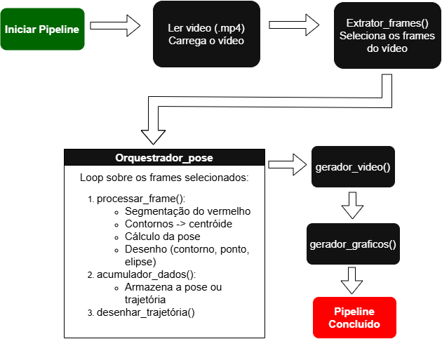

# **Projeto RoboPose**

## 📝 Rastreamento de Robô por Visão Computacional

### 📌 Descrição do Projeto

Este projeto implementa um pipeline completo de rastreamento de um robô utilizando visão computacional, segmentação por cromaticidade no espaço RGB, detecção de contornos, extração de centróide, cálculo de orientação (theta) via matriz de inércia e autovalores, além de conversão das coordenadas de pixel para o mundo real (mm).

Ao final, o sistema gera:

- 🎥 Vídeo com a trajetória desenhada  
- 📈 Gráficos da pose (X, Y, θ) ao longo do tempo  
- ▶️ Visualização em tempo real dos frames processados  

---

### 🧩 Arquitetura do Pipeline

---

### 🛠 Dependências

- Python 3.8+
- NumPy
- OpenCV
- Matplotlib
- IPython.display

